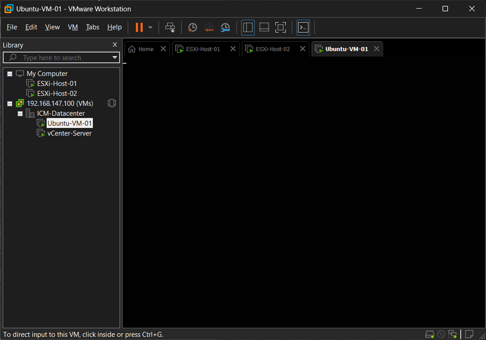
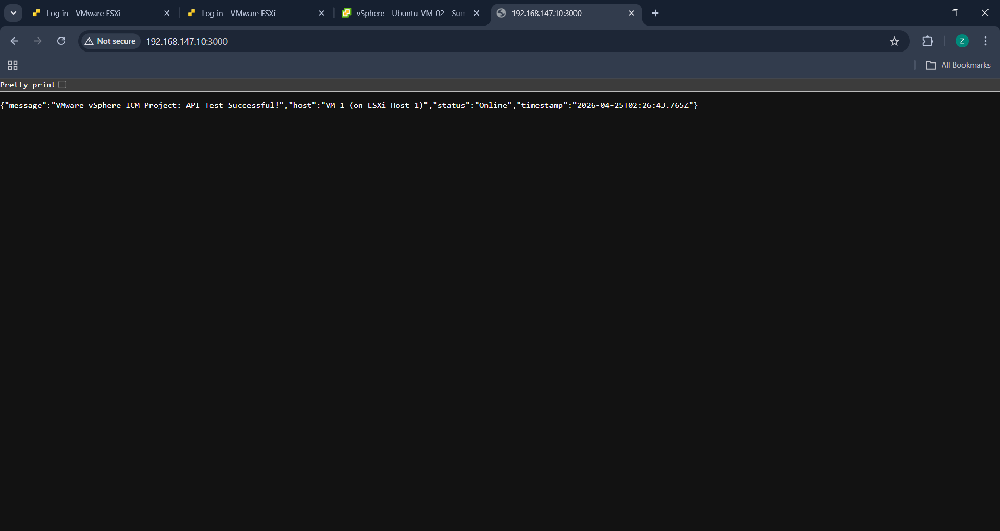
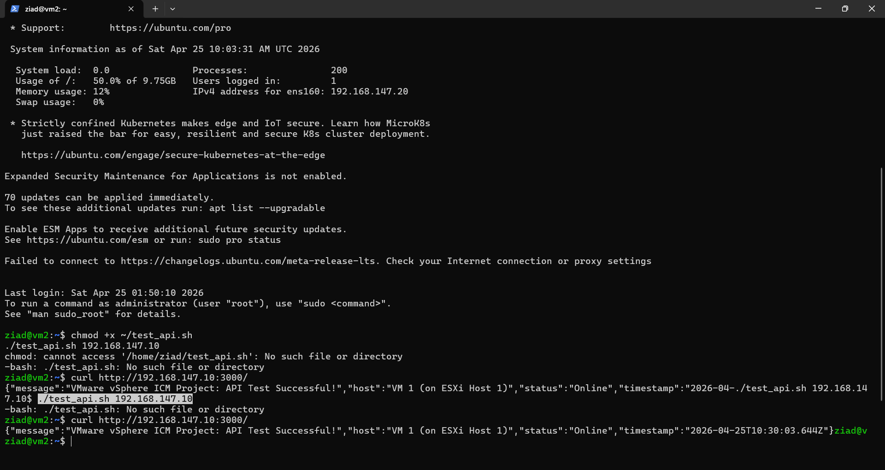
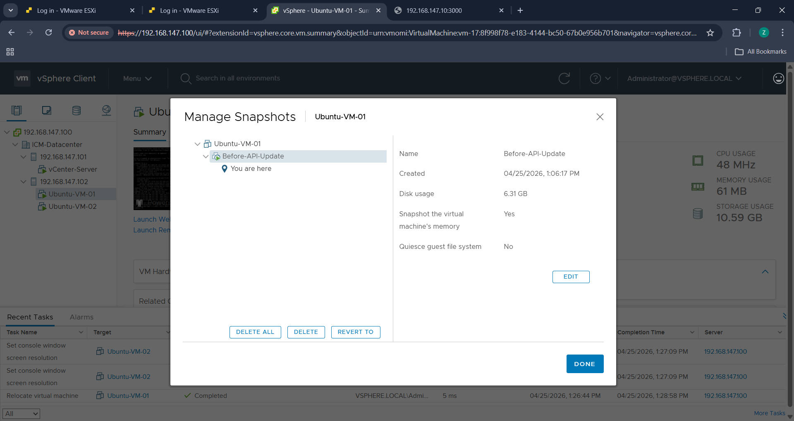
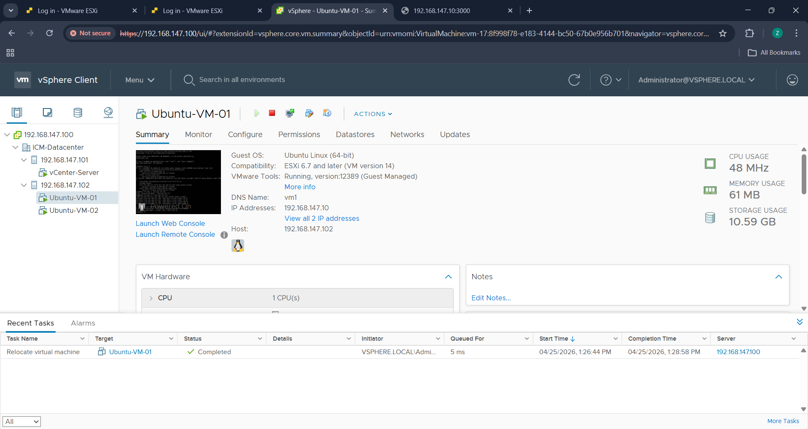

# 🖥️ VMware vSphere ICM Lab

A virtualization lab built on **VMware vSphere 6.7**, nested inside VMware Workstation. Two ESXi hosts are managed centrally by vCenter Server (VCSA). Two Ubuntu VMs on different hosts run and test a small Node.js API. The lab also covers snapshots, live migration (vMotion), cloning and OVF-based backup.

## Architecture

```
                    VMware Workstation (nested lab, 192.168.147.0/24)
 ┌───────────────────────────────────────────────────────────────────────────┐
 │                vCenter Server Appliance 6.7  (192.168.147.100)             │
 │                      Datacenter: ICM-Datacenter                            │
 │        ┌─────────────────────────────┐   ┌─────────────────────────────┐   │
 │        │ ESXi-Host-01 (.101)         │   │ ESXi-Host-02 (.102)         │   │
 │        │  └─ Ubuntu-VM-01 (.10)      │◄──┼─ Ubuntu-VM-02 (.20)         │   │
 │        │     Node.js API :3000       │   │    test client (curl/ping)  │   │
 │        └─────────────────────────────┘   └─────────────────────────────┘   │
 │                     ◄──── vMotion: VM-01 moved between hosts ────►          │
 └───────────────────────────────────────────────────────────────────────────┘
```

| Component | Address | Role |
|---|---|---|
| vCenter (VCSA 6.7) | 192.168.147.100 | Central management, SSO domain `vsphere.local` |
| ESXi-Host-01 | 192.168.147.101 | Hosts vCenter and Ubuntu-VM-01 |
| ESXi-Host-02 | 192.168.147.102 | Hosts Ubuntu-VM-02 |
| Ubuntu-VM-01 | 192.168.147.10 | Runs the API ([`api/server.js`](api/server.js)) on port 3000 |
| Ubuntu-VM-02 | 192.168.147.20 | Runs the test script ([`tests/test_api.sh`](tests/test_api.sh)) |

## What the lab covers

1. **ESXi installation:** two ESXi 6.7 hosts with static management IPs.
2. **vCenter deployment:** VCSA installed in two stages, with a datacenter created and both hosts added.
3. **Guest VMs:** Ubuntu Server 22.04 on each host.
4. **Cross-host API testing:** VM 2 pings VM 1 and calls the API across hosts.
5. **Snapshot:** a memory snapshot of VM 1 (`Before-API-Update`).
6. **vMotion:** VM 1 migrated live between hosts while running.
7. **Clone:** VM 2 cloned to `Ubuntu-VM-02-Clone`.
8. **Backup:** VM 1 exported as OVF. The descriptor and manifest are in [`backup/`](backup); the disk images are too large for Git.

## Screenshots

| | |
|---|---|
|  |  |
| Nested lab in VMware Workstation | API response from VM 1 |
|  |  |
| VM 2 calling the API on VM 1 across hosts | Snapshot of VM 1 in the vSphere Client |


*After vMotion: Ubuntu-VM-01 running on host 192.168.147.102, with the "Relocate virtual machine" task completed.*

## The API

A small Node.js server built on the built-in `http` module:

| Endpoint | Response |
|---|---|
| `GET /` | JSON with a success message, host and timestamp |
| `GET /health` | `API is healthy and reachable from the network.` |

```bash
# on VM 1
cd api && node server.js

# on VM 2
chmod +x test_api.sh
./test_api.sh 192.168.147.10
```

## Documentation

- [`docs/Step_by_Step_Build.md`](docs/Step_by_Step_Build.md): the full build from zero to done, including fixes for the errors hit along the way. Passwords are replaced with `<YOUR_PASSWORD>`.
- [`docs/Setup_Guide.md`](docs/Setup_Guide.md): a short overview of the phases.
- [`docs/Lab_Report.md`](docs/Lab_Report.md): the lab report with addresses and results.

## Tech stack

VMware vSphere 6.7 · ESXi · vCenter Server Appliance · VMware Workstation · Ubuntu Server 22.04 · Node.js · Bash
